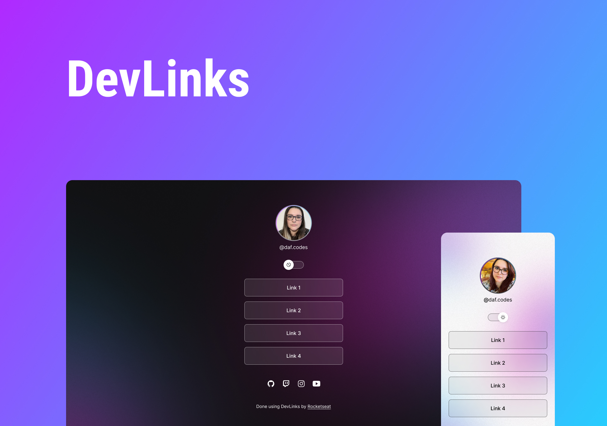

<h1 align="center"> DevLinks </h1>

  <a href="#-technologies">Technologies</a>&nbsp;&nbsp;&nbsp;|&nbsp;&nbsp;&nbsp;
  <a href="#-project">Project</a>&nbsp;&nbsp;&nbsp;|&nbsp;&nbsp;&nbsp;
  <a href="#-layout">Layout</a>&nbsp;&nbsp;&nbsp;|&nbsp;&nbsp;&nbsp;
  <a href="#memo-license">License</a>

  

 

  

## 🚀 Stack

This project was developed using the following technologies:

- HTML and CSS
- JavaScript
- Figma

## 💻 Project

The scope of this project is to use it as a Presentation page.

##Link for the website:
[THIS LINK](https://dafs-presentationpage.netlify.app/)

## 🔖 Layout

You can access this figma project here [THIS LINK](https://www.figma.com/file/IHMSGCqkne27xTxk6DnwdA/DevLinks-(Community)?node-id=58%3A455&t=mkDO3pP3c4jGR2f1-1)

## :memo: License

This project has a license MIT.

---

Feito com ♥ by Rocketseat :wave: [Participe da nossa comunidade!](https://discord.gg/rocketseat)
